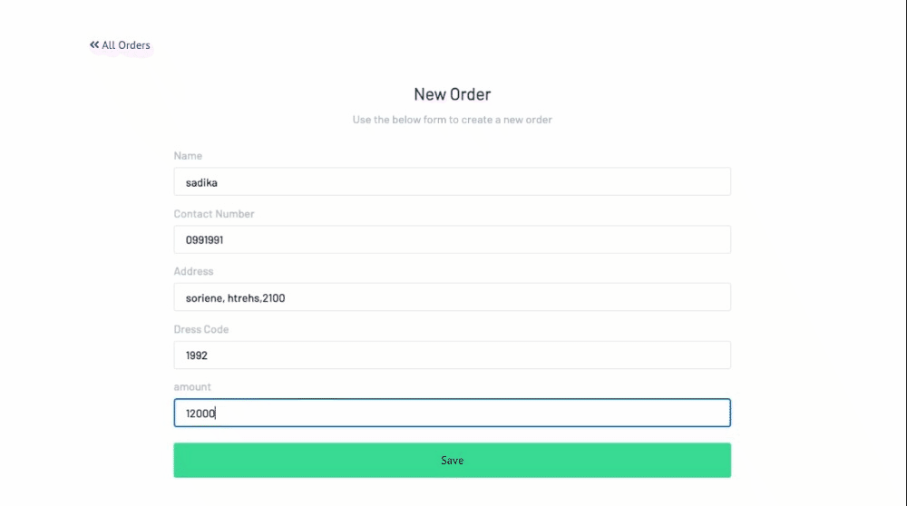

# order-management-system
 <a href="https://pokedexbysadika.netlify.app/">Visit here</a>
The pokemon index project using PokeAPI is a web based application that allows users to browse through the whole pokemon list along with their details such as pokemon type.

# How it's made:
Tech used: HTML, CSS, JavaScript, PokeAPI

First, I spent some time researching the 90's Gameboy aesthetic to get a sense of the color palette, typography, and overall look and feel. I wanted to make sure that the design of my project was authentic and captured the essence of the Gameboy era.
Once I had a good idea of what I wanted to achieve, I started building the layout using HTML and CSS.

After building the layout, I added event listeners to handle user click. For example, I used buttons to move to the next list of pokemon.

Next, I worked with an API to retrieve data and update the aplication state. This involved making requests to the API and processing the response data to update the display board.
Throughout the development process, I tested my code frequently to ensure that everything was working as expected. I used tools like Chrome DevTools to debug any issues and make sure that the API was working properly.

Finally, I deployed my project to a web server so that others could use the pokedex web application and retrieve pokemon information. I used Netlify to host my application and ensure that it was available to users 24/7.

# Lesson learned:
Building this project was a challenging but rewarding experience. I learned a lot about web development, APIs, and I'm excited to continue exploring these areas in future projects.
